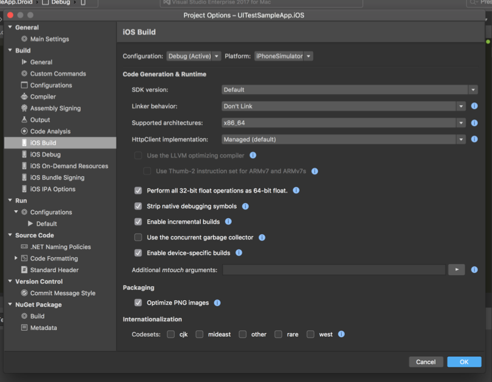
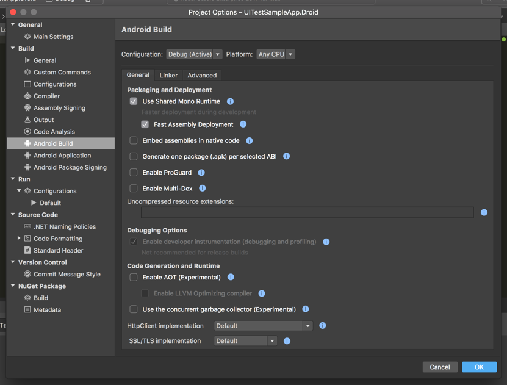
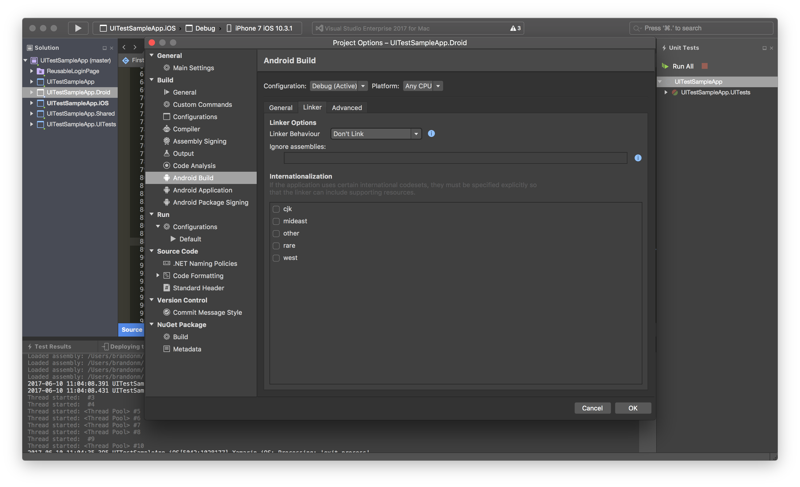
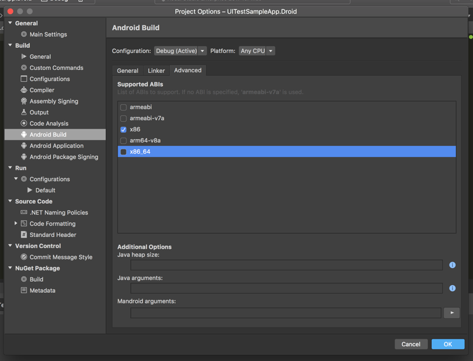
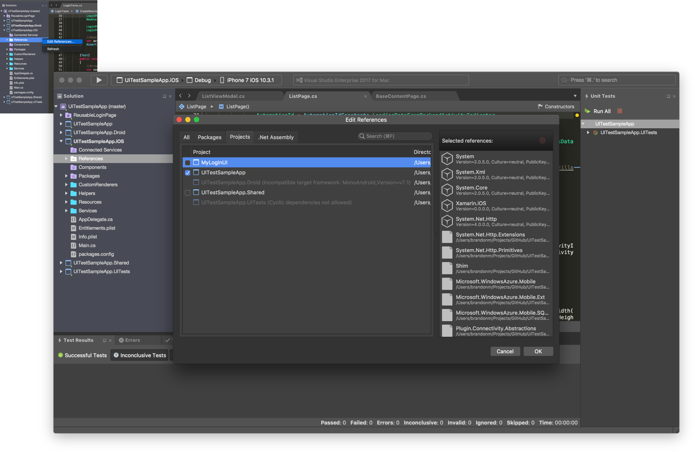

# About

## Purpose

Sometimes Xamarin Build times can take a long time, adding delays to our development timeline. Below are tips to reduce the compilation time for Debug Configuration builds.

The screenshots below were created on 10 June 2017 using [Visual Studio for Mac](https://www.visualstudio.com/vs/visual-studio-mac/) v7.0.1 and [UITestSampleApp](https://github.com/brminnick/UITestSampleApp).

## Disclaimer

These recommendations are only meant for Debug Configuration builds. They will reduce the time for each compilation, but may increase the size of the app and decrease the performance and load-time of the app.

I highly recommend utilizing the Linker for Release Configuration builds; `Link SDKs and Frameworks` is my recommended minimum setting. I also highly recommend heavily testing the Release Configuration build of the app because the app may behave differently when the Linker is utilized.

# iOS Build Settings

- Linker behavior: Don’t Link for Simulator Builds, Link on Devices Builds
  - The Linker will reduce the amount of managed code which means less native code to AOT compile
  - Simulator builds don't AOT compile, but Device builds do AOT compile
- Enable incremental builds
  - Allows the AOT compiler to compile only the code that changed
- Enable device-specific builds
  - This encourages the compiler to only compile for the targeted device
  - This allows you to select many supported architectures
  - Selecting multiple architectures without enabling device-specific builds will cause compilation to take longer
    - X86_64 Architecture works for iPhone Simulators 5s - 7
    - i386 Architecture works for iPhone Simulators earlier than the iPhone 5s

# Android Build Settings

## General

- Use Shared Mono Runtime
  - This will install Mono on the targeted device
  - Installing Mono on the device means that Mono doesn't have to be bundled in the APK, making the APK quicker to compile and deploy
- Fast Assembly Deployment
  - Deploys assemblies to a directory on the device instead of bundling them in the APK
  - The APK compiles faster, is smaller, and  is faster to deploy
  - Allows Xamarin to deploy individual changed assemblies instead of rebuilding/redeploying the entire APK

## Linker

- Linker Behavior: Link SDK assemblies only
  - The Linker will reduce the amount of managed code which means less native code to compile
  - Because Android uses emulators which behave similarly to Android devices, there isn't a recommended difference between Emulator & Device builds for the Linker settings like there is for iOS

## Advanced

- Supported ABIs
  - Select the ABI for the targeted device
  - E.g. if you’re deploying to an x86 emulator, only select the x86 ABI

# Project References

- Limit the number of referenced projects in the solution
- Compilation time increases for every referenced PCL
  - Referenced PCLs will compile first, then the Startup Project will compile
  - Using Shared Projects allows the project to compile faster than PCLs